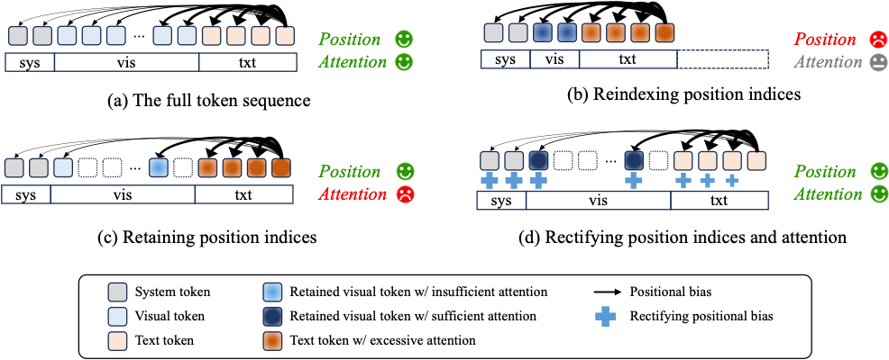

# [ICML 2026] RESTORE: Improving Visual Token Reduction via Rectifying Distortions for Efficient Multimodal LLM Inference

[](https://arxiv.org/abs/2606.01711)
[](https://cvlab.yonsei.ac.kr/projects/RESTORE/)

<p align="center">
  
</p>

## Contents

- [Installation](#installation)
- [Dataset](#dataset)
- [Evaluation](#evaluation)
- [Implementation](#implementation)
- [Acknowledgement](#acknowledgement)
- [Citation](#citation)
- [TODO](#todo)
- [License](#license)

## Installation

1. Clone this repository

```bash
git clone https://github.com/cvlab-yonsei/RESTORE.git
cd RESTORE
```

2. Create and set up a conda environment

   Our environment follows [LLaVA](https://github.com/haotian-liu/LLaVA), so please install it directly by cloning the LLaVA repository and installing it in the conda environment:

```bash
# Create conda env
conda create -n restore python=3.10 -y
conda activate restore

# Install LLaVA env
git clone https://github.com/haotian-liu/LLaVA.git
pip install --upgrade pip  # enable PEP 660 support
pip install -e LLaVA

# protobuf: needed by the slow LlamaTokenizer (use_fast=False) to parse the SentencePiece tokenizer model
pip install protobuf==6.31.1
```

3. Install tokenreduction baselines

```bash
pip install -e tokenreduction
```

## Dataset

We follow the evaluation protocol of [LLaVA](https://github.com/haotian-liu/LLaVA/blob/main/docs/Evaluation.md).
Please download and prepare each benchmark as described there, and place them under `playground/data/eval/` so that the directory looks like:

```
RESTORE/
└── playground/
    └── data/
        └── eval/
            ├── gqa/
            ├── mmbench/
            ├── MME/
            ├── ocrbench/
            ├── pope/
            ├── scienceqa/
            ├── seed_bench/
            ├── textvqa/
            └── vqav2/
```

## Evaluation

We recommend setting the following environment variables so that the LLaVA-1.5-7B checkpoint is downloaded (and cached) to the path of your choice:

```bash
export HF_HOME=<path_to_checkpoint>
export HF_HUB_CACHE=<path_to_checkpoint>
```

Each benchmark is evaluated through the scripts under `scripts/llava1_5/`. The reduction behavior is controlled by three arguments:

- `--base` &mdash; the visual token reduction baseline: `HoloV`, `DivPrune`, or `VisPruner`.
- `--n_vis` &mdash; the number of retained visual tokens (e.g., `64`, `128`, `192`).
- `--restore` &mdash; when present, applies **RESTORE** on top of the baseline (rectifying distortions via token size and distance calibration). When omitted, the plain baseline reduction is used.

Heavy benchmarks (e.g., GQA, VQAv2, SEED) shard the workload across all GPUs listed in `CUDA_VISIBLE_DEVICES`, while light benchmarks (e.g., MME, POPE) run on a single GPU.

```bash
# GQA with RESTORE (8 GPUs)
CUDA_VISIBLE_DEVICES=0,1,2,3,4,5,6,7 bash scripts/llava1_5/gqa.sh \
    --base HoloV --n_vis 64 --restore

# MME with RESTORE (1 GPU)
CUDA_VISIBLE_DEVICES=0 bash scripts/llava1_5/mme.sh \
    --base HoloV --n_vis 64 --restore

# Baseline only (drop --restore)
CUDA_VISIBLE_DEVICES=0,1,2,3,4,5,6,7 bash scripts/llava1_5/gqa.sh \
    --base HoloV --n_vis 64
```

Available benchmark scripts: `gqa.sh`, `vqav2.sh`, `seed.sh`, `mmbench.sh`, `mme.sh`, `pope.sh`, `sqa.sh`, `textvqa.sh`, `ocrbench.sh`.

## Implementation

- [`llava/model/modeling_llama_restore.py`](llava/model/modeling_llama_restore.py) implements the attention calibration inside the LLM.
- [`tokenreduction/tore`](tokenreduction/tore) implements the baseline visual token reduction methods, along with our merging that applies distinctive anchor token selection.

The baselines are organized in a modular form, so a new baseline reduction method can be added easily. Additional contributions are welcome!

## Acknowledgement

This repository is built on top of [LLaVA](https://github.com/haotian-liu/LLaVA/tree/main). It also makes use of code from [DivPrune](https://github.com/vbdi/divprune), [VisPruner](https://github.com/Theia-4869/VisPruner), and [HoloV](https://github.com/obananas/HoloV). We thank all the contributors of these repositories.

## Citation

If you find this work helpful, please consider citing it with the BibTeX below and giving this repository a ⭐!

```bibtex
@inproceedings{cho2026improving,
  title={Improving Visual Token Reduction via Rectifying Distortions for Efficient Multimodal LLM Inference},
  author={Cho, Hyeonwoo and Baek, Donghyeon and Kim, Yewon and Ham, Bumsub},
  booktitle={International Conference on Machine Learning},
  year={2026}
}
```

## TODO

We will add implementations for other models (e.g., Qwen2.5-VL).

## License


This project is released under the [GPL-3.0 license](LICENSE).
